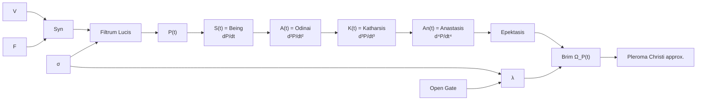

# V.F.S. Open-Gate
*Open Balance / Open-Gate v.2.0 Model*

**Theological-Dynamical Framework**  
*Differential Geometry of Filtrum Lucis* 

---

## Short Description

V.F.S. is a symbolic-theological dynamical system with a Lyapunov-stable active transformation domain. Its theological semantics are interpretive, but the stability claim is mathematical and local-to-basin, not decorative.

In short:
> V.F.S. is a symbolic dynamical language for describing how will becomes action, action becomes being, resistance is transformed into wisdom, and death-like closure can become the threshold of new life.

## Purpose

The framework is intended as a bridge between theological language, symbolic mathematics, and systems thinking. It can be used to translate paradoxical biblical or philosophical statements into dynamic structures: for example, “the last shall be first,” “let the dead bury their dead,” or resurrection as a transition from an old form through hidden transformation into a new mode of being.

## Key component
A key component of the framework is Filtrum Lucis, a smooth transmissivity function defined over the difference between synergy and resistance.

## Conceptual Flow of V.F.S.

### Core Concepts

* **V** — **Voluntas**: will, inner orientation, the movement of willing.
* **F** — **Factum**: action, the concrete embodiment of will.
* **Syn** — **Gratia Synergica**: the living cooperation of will, action, and grace.
* **Filtrum Lucis** — a smooth softplus light-filter; its transmissivity is sigmoid-shaped.
* **σ** — **Resistance**: singular resistance, deformation, or inner obstruction.
* **λ** — **Sophia**: accumulated wisdom; resistance transmuted and, in the Open-Gate version, nourished by received grace.
* **P(t)** — **Pleroma**: fullness itself, the unfolding fullness of the Vessel.

### Derivative Ladder of Pleroma

* **S(t)** — **Being / Sum / Gignesthai**: the first dynamic expression of Pleroma.
* **A(t)** — **Odinai**: the birth-pang acceleration of becoming.
* **K(t)** — **Katharsis**: the cathartic turn of transformation.
* **An(t)** — **Anastasis**: the resurrectional emergence of a new mode of being.

After **Anastasis**, V.F.S. opens toward **Epektasis**, **Ω_P(t)** as **Brim Expansion**, and **Pleroma Christi**.

## Lyapunov Stability Check
The framework has also passed a Lyapunov-domain verification check, confirming that within the tested domain its core dynamics exhibit stable, bounded behavior under the proposed transformation conditions.

## Audit
For a full mathematical audit of the model, I recommend using advanced OpenAI or Anthropic models.

---

**Site**: [avequ.com](https://avequ.com/)
